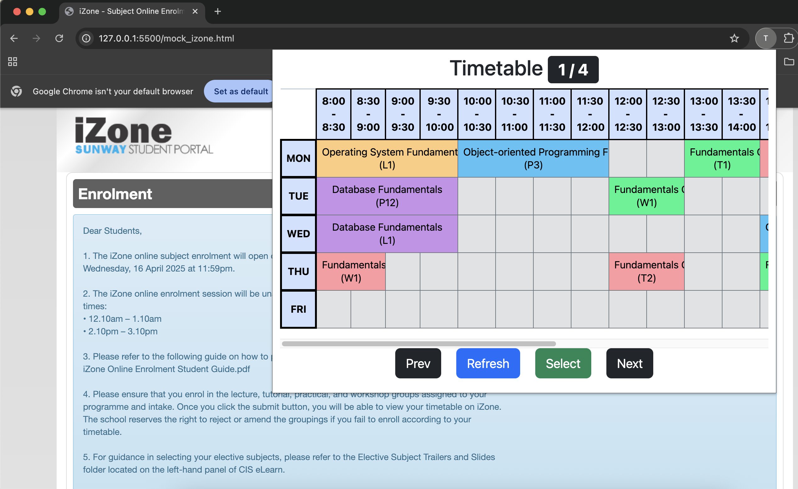

# iZone Timetable Visualizer Chrome Extension

A chrome extension used to visualize different combinations of classes on iZone (Sunway Student Portal).



---

# Installation

1. Clone the repository (or download the zip file) using
```bash
git clone https://github.com/applejuice8/timetable-visualizer.git
```

2. Open chome extensions page on Google Chrome (`chrome://extensions/`).

3. In the top-right corner of the extensions page, toggle Developer mode ON.

4. Load the extension
    1. Click `Load unpacked` in the top-corner of the extensions page.
    2. Select the project root folder (`timetable-extension/`).

---

# Usage

1. In `popup/timetable.js`, edit the `mySubjects` list to your respective subjects. You do not need the full subject name, just a unique substring such as "operating system" instead of "Operating System Fundamentals".

2. Navigate to iZone timetable selection page `https://izone.sunway.edu.my/...`

3. If it is not during the timetable selection period, the `mock_izone.html` can be used to test the chrome extension.
    1. Open `mock_izone.html` in your code editor.
    2. Right click the file and select `Open with Live Server`.
    3. Navigate to the link serving the html file (Likely `http://127.0.0.1:5500/mock_izone.html`).

4. In the top right corner of the browser, click the extension button and select `Timetable Visualizer`.

5. The `Refresh`, `Select`, `Prev` and `Next` buttons can be used accordingly.

---

# Architecture Flow

```bash
# Scrape
timetable.js
    ↓ 1. chrome.runtime.sendMessage({ type: 'SCRAPE' })
    ↑ 4. chrome.runtime.sendMessage({ type: 'SCRAPED_DATA' })
background.js
    ↓ 2. chrome.tabs.sendMessage(tabs[0].id, { type: 'SCRAPE' })
    ↑ 3. chrome.runtime.sendMessage({ type: 'SCRAPED_DATA' })
scrape.js

# Select
timetable.js
    ↓ chrome.runtime.sendMessage({ type: 'SELECT' })
background.js
    ↓ chrome.tabs.sendMessage(tabs[0].id, { type: 'SELECT' })
scrape.js
```
